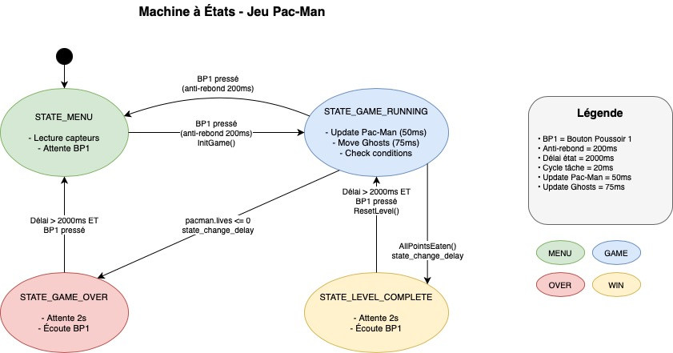
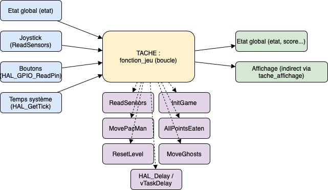
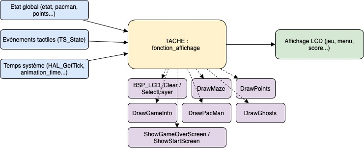

# 442jeuPACMAN

Mini-projet de l'UE 442 - Systèmes embarqués

**Jeu Pac-Man** complet avec gestion des entités, des collisions, du score, et des états de jeu
- Affichage graphique sur LCD avec animations
- Contrôle par joystick (ADC)
- Multitâche : logique et affichage séparés pour plus de fluidité
- Extensible : facile à améliorer

Voici le schéma synoptique du projet :

## Fichiers principaux

- `maze.c` / `maze.h` : sous-fonctions d'affichage, gestion des entités
- `freertos.c` : tâches FreeRTOS, machine à états principale
- `main.c` : initialisation matérielle, démarrage du scheduler

## Machine à états

Le jeu fonctionne selon 4 états principaux :
- **STATE_MENU** : écran d’accueil, attente du joueur
- **STATE_GAME_RUNNING** : jeu en cours
- **STATE_LEVEL_COMPLETE** : niveau terminé
- **STATE_GAME_OVER** : fin de partie

Les transitions se font via les boutons ou selon les événements du jeu (tous les points mangés, plus de vies…).

---
# Fonctionnalités

## 🎮 Logique de jeu (`maze.c`)

### **Initialisation et affichage du labyrinthe**
- `InitWalls()` : Initialise la structure du labyrinthe (murs, bordures)
- `DrawMaze(uint32_t color)` : Affiche le labyrinthe sur l'écran LCD

### **Gestion des points à collecter**
- `InitPoints()` : Place les pastilles (points) dans le labyrinthe
- `DrawPoints(uint32_t color)` : Affiche les points restants
- `CheckPointsCollision(PacMan *pacman)` : Détecte et gère la collecte des points par Pac-Man
- `AllPointsEaten()` : Vérifie si tous les points ont été mangés

### **Gestion de Pac-Man**
- `InitPacMan(PacMan *pacman)` : Initialise la position, la direction, le score et les vies de Pac-Man
- `DrawPacMan(PacMan *pacman, uint32_t color)` : Affiche Pac-Man avec animation de la bouche
- `MovePacMan(PacMan *pacman, uint32_t joy_h, uint32_t joy_v)` : Met à jour la position de Pac-Man selon le joystick, gère les collisions et la collecte des points

### **Gestion des fantômes**
- `InitGhosts()` : Initialise la position et l'état des fantômes
- `DrawGhost(Ghost *ghost)` et `DrawGhosts()` : Affichent un ou tous les fantômes
- `MoveGhost(Ghost *ghost, PacMan *pacman)` et `MoveGhosts(PacMan *pacman)` : Déplacement automatique des fantômes, gestion de l'IA simple (poursuite/dispersé)
- `GetBestGhostDirection(Ghost *ghost, PacMan *pacman)` : Calcule la meilleure direction pour chaque fantôme

### **Gestion des collisions et des états**
- `IsPositionInWall(int x, int y, int width, int height)` : Détecte les collisions avec les murs
- `ResetLevel(PacMan *pacman)` : Réinitialise les points et augmente la difficulté après un niveau réussi

### **Affichage des informations de jeu**
- `DrawGameInfo(PacMan *pacman)` : Affiche le score et le nombre de vies
- `ShowStartScreen()` : Affiche l'écran de menu
- `ShowGameOverScreen(int score)` : Affiche l'écran de fin de partie

### **Lecture des entrées**
- `ReadSensors(uint32_t *joy_v, uint32_t *joy_h)` : Lit les valeurs du joystick via l'ADC

---

## ⏲️ Orchestration multitâche (FreeRTOS, `freertos.c`)

### **Tâche logique du jeu**
Appelle dans sa boucle principale :
- `ReadSensors()` pour lire le joystick
- `MovePacMan()` pour déplacer Pac-Man
- `MoveGhosts()` pour déplacer les fantômes
- `AllPointsEaten()` et `ResetLevel()` pour gérer la progression
- Gère la machine à états (menu, jeu, niveau fini, game over) via la variable `etat`

### **Tâche d'affichage**
Appelle périodiquement :
- `DrawMaze()`, `DrawPoints()`, `DrawPacMan()`, `DrawGhosts()`, `DrawGameInfo()`
- `ShowStartScreen()`, `ShowGameOverScreen()` selon l'état du jeu
- Rafraîchit l'écran LCD en fonction de l'état courant

## Pistes d'amélioration 

- Il y a un probleme de mise à jour de pacpman.lives => le jeu ne se termine pas lorsque l'on meurt trois fois ou plus
- Augmenter la vitesse pour monter de niveau lorsque l'on a gagné
- Ajouter d'autres labyrinthes (maze)
- Modifier la `MoveGhost` pour qu'ils aillent partout et poursuivent PacMan correctement dans la pratique
